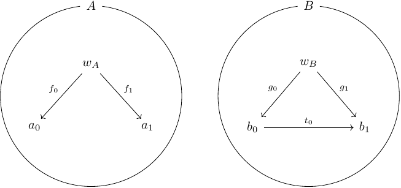

# 1. 観測者とはなにか

## 数学的準備

視点学では、観測者は圏として定義されます。ここで圏の定義を導入します。

### 定義1-1 圏
**圏**\( A \)とは、
- **対象**の集まり\(\mathrm{ob}(A)\)
- 各\(a,b \in \mathrm{ob}(A)\)について、\(a\)から\(b\)への**射**の集まり\(A(a,b)\)
- 各\(a,b,c \in \mathrm{ob}(A)\)について、**合成**と呼ばれる関数
$$
\begin{alignedat}{3}
A(b,c) &\times A(a,b) & &\to & A&(a,c)\\
(&g,f) & &\mapsto & &g \circ f 
\end{alignedat}
$$
- 各\(a \in \mathrm{ob}(A)\)について、\(a\)上の**恒等射**と呼ばれる\(A(a,a)\)の元\(1_a\)

からなり、以下の公理を満たすもののことです。

- **結合法則**：任意の\(f \in A(a,b), g \in A(b,c), h \in A(c,d)\)について\((h \circ g) \circ f = h \circ (g \circ f)\)が成り立つ
- **単位法則**：任意の\(f \in A(a,b)\)について\(f \circ 1_a = f = 1_b \circ f\)が成り立つ

<!-- 

  
  
図1-1 圏の例

  -->

簡単のため、以下の記法が使われることがあります。

$$
\begin{aligned}
a \in \mathrm{ob}(A) &\iff a \in A \\
f \in A(a,b) &\iff f:a \to b \\
&\iff a \overset{f}{\to} b \\
\\
g \circ f &= gf \\
A(a,b) &= \mathrm{Hom}_A{(a,b)} \\
&= \mathrm{Hom}(a,b)
\end{aligned}
$$

### 定義1-2 ドメイン、コドメイン
\(f \in A(a,b)\)について、\(a\)を\(f\)の**ドメイン**と呼び、\(b\)を\(f\)の**コドメイン**と呼びます。

### 定義1-3 始対象
\(A\)を圏とします。対象\(w \in A\)が**始対象**であるとは、任意の\(a \in A\)についてただひとつの射\(w \to a\)が存在することをいいます。

<!-- 

  
  
図1-2 始対象の例

  -->

## 観測者の定義

### 定義1-4 観測者
\(A\)が**観測者**であるとは、\(A\)が高々有限個の対象からなる圏であり、かつ始対象である対象\(w \in A\)が存在することをいいます。このとき、\(w\)は**世界対象**と呼ばれます。また、世界対象をドメインとして持つ射を**観測方法**と呼び、そのときのコドメインを**観測値対象**と呼びます。
世界対象に関する恒等射 以外の観測方法を**狭義観測方法**と呼び、狭義観測方法のコドメインを**狭義観測値対象**と呼びます。また、ドメインとコドメインがともに狭義観測値対象である射のことを**観測値の変換**と呼びます。

注：この定義は、読者が想像する観測者のイメージとはあまりにかけ離れているかもしれません。しかしながら、この方法で定義された観測者は、一般にイメージされる「人間的な」観測者ならびに観測装置を単純化・抽象化したものであり、現実における「人間的な」観測者とおおむね対応します。

<!-- 

  
  
図1-3 観測者の例

  -->

定義より、以下の命題が直ちに従います。
- 観測者を定めたとき、観測者には必ず世界対象が存在する。
- 観測者を定めたとき、観測者に世界対象が存在するならばそれはただひとつに限られる（始対象は存在するならただひとつであることが証明できます）。
- 観測者に属する対象は、すべて観測値対象である（世界対象も観測値対象であることに注意してください）。
- 対象\(a\)から\(b\)への観測値の変換は、存在するならただひとつに限られる。